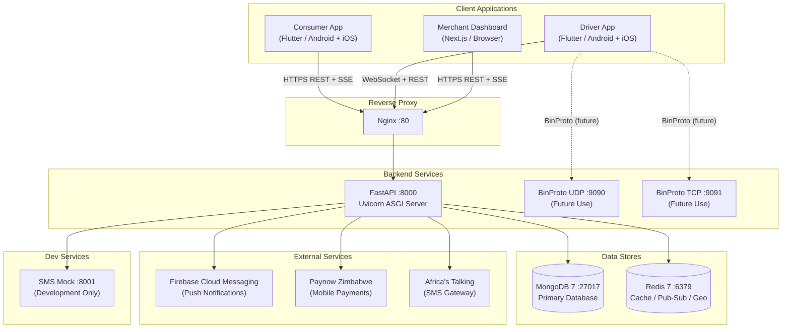
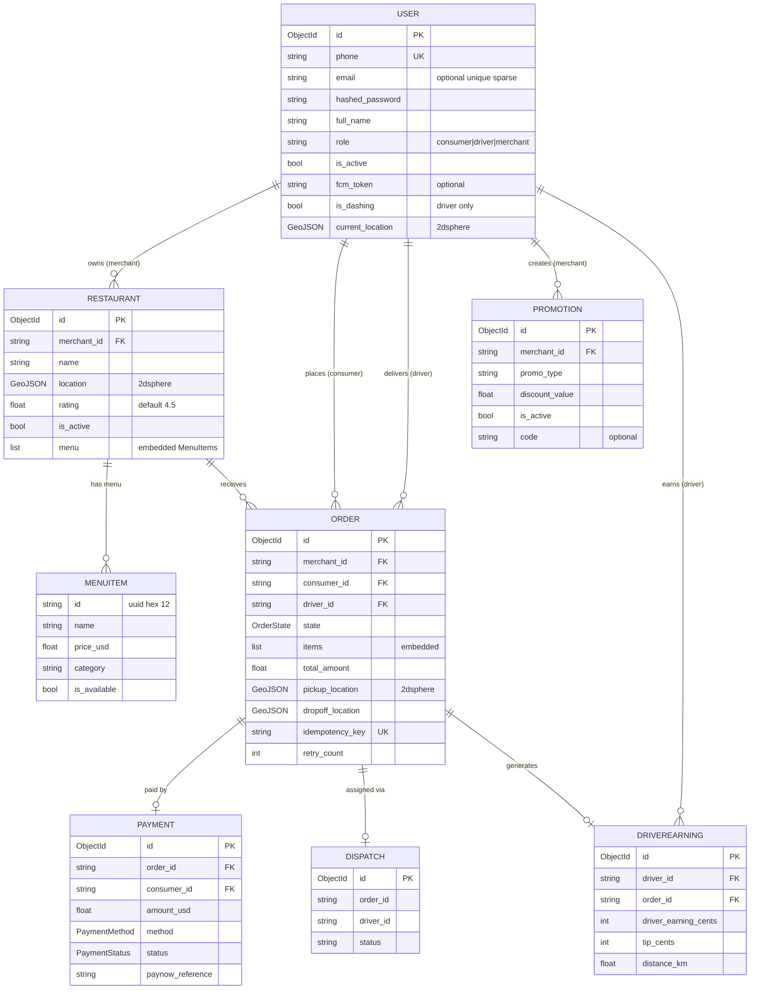
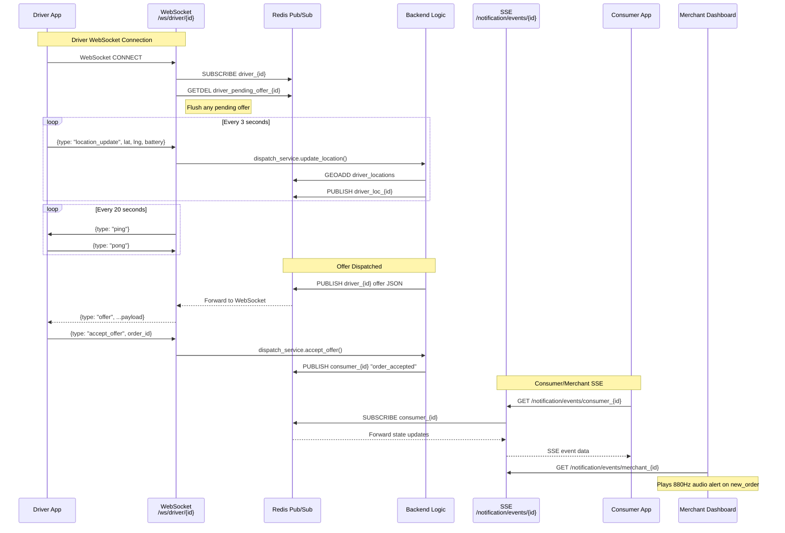
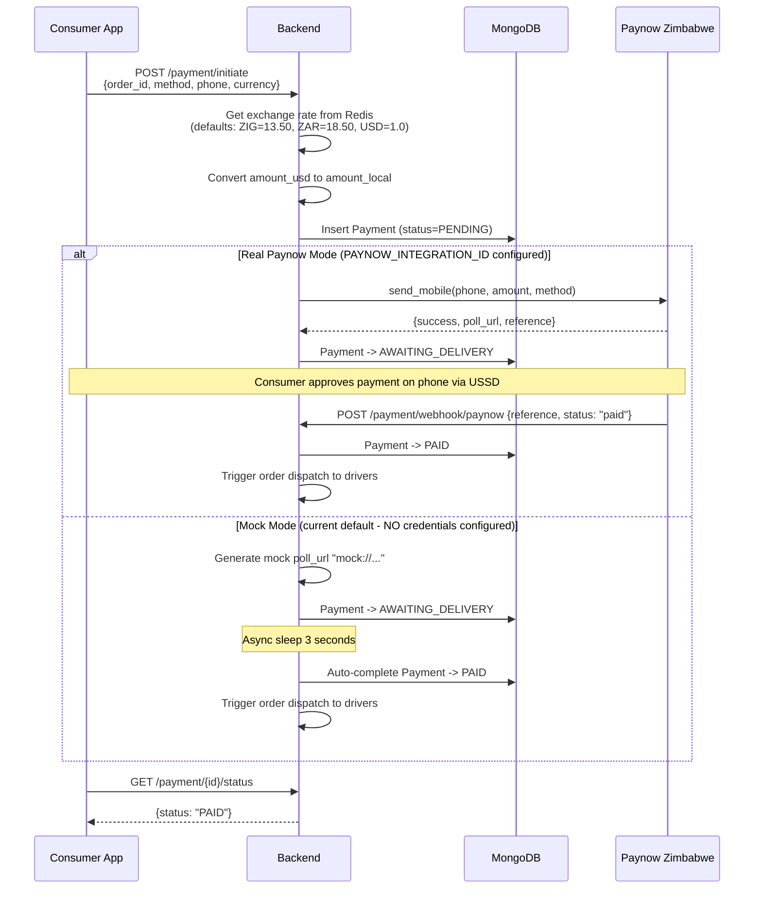
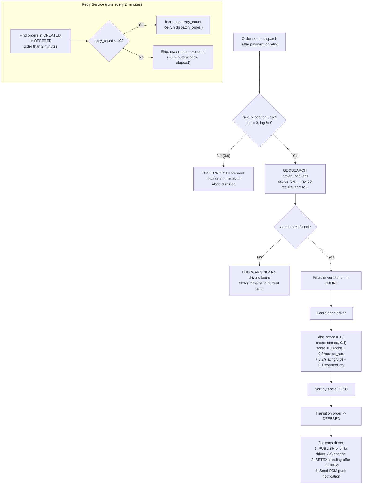
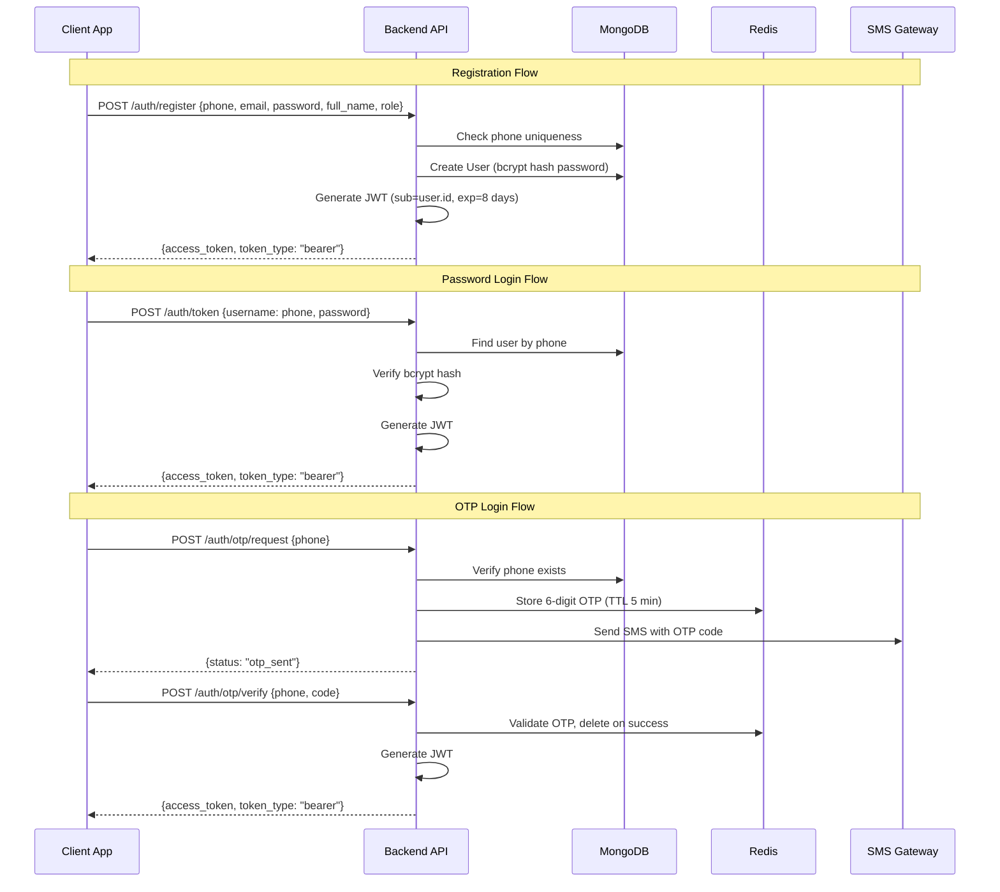
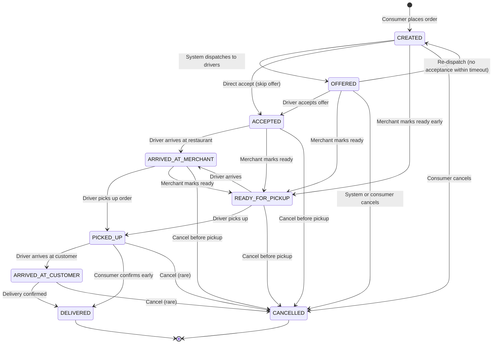

# Zvingo — Comprehensive System Documentation

> **Version:** 1.0.0  
> **Last Updated:** February 19, 2026  
> **Classification:** Internal — Engineering & Sales

---

## Table of Contents

1. [Executive Summary](#1-executive-summary)
2. [System Architecture Overview](#2-system-architecture-overview)
3. [Technology Stack](#3-technology-stack)
4. [Backend API (Python/FastAPI)](#4-backend-api)
5. [Consumer Mobile App (Flutter)](#5-consumer-mobile-app)
6. [Driver Mobile App (Flutter)](#6-driver-mobile-app)
7. [Merchant Dashboard (Next.js)](#7-merchant-dashboard)
8. [Infrastructure & DevOps](#8-infrastructure--devops)
9. [Data Models & Database Schema](#9-data-models--database-schema)
10. [Real-Time Communication Architecture](#10-real-time-communication-architecture)
11. [Payment System](#11-payment-system)
12. [Dispatch & Delivery Engine](#12-dispatch--delivery-engine)
13. [Notification System](#13-notification-system)
14. [Finance & Earnings Engine](#14-finance--earnings-engine)
15. [Authentication & Security](#15-authentication--security)
16. [API Reference](#16-api-reference)
17. [User Flows & Diagrams](#17-user-flows--diagrams)
18. [Tech Debt & Known Issues](#18-tech-debt--known-issues)
19. [Deployment Guide](#19-deployment-guide)
20. [Sales Pitch Reference](#20-sales-pitch-reference)

---

## 1. Executive Summary

**Zvingo** is a full-stack, on-demand food delivery platform purpose-built for the **Zimbabwe market**. It connects consumers, restaurants, and delivery drivers through three dedicated client applications and a centralized backend.

### Core Value Propositions

| Stakeholder | Value |
|---|---|
| **Consumers** | Browse nearby restaurants, order food, track deliveries in real-time on a map, pay via local mobile money (EcoCash, OneMoney, InnBucks) |
| **Restaurants/Merchants** | Manage menus, receive real-time orders via Kanban board, run promotions, track analytics |
| **Drivers** | Receive delivery offers with earnings preview, navigate pickup → delivery, track earnings, schedule shifts |
| **Platform** | 15% commission on every delivery, exchange rate management (USD/ZIG/ZAR), full order lifecycle management |

### Platform Components

| Component | Technology | Platform |
|---|---|---|
| Backend API | Python 3.12 / FastAPI | Server (Docker) |
| Consumer App | Flutter / Dart | iOS, Android, Web |
| Driver App | Flutter / Dart | iOS, Android |
| Merchant Dashboard | Next.js 16 / React 19 | Web |
| Reverse Proxy | Nginx | Docker |
| Database | MongoDB 7 | Docker |
| Cache / Pub-Sub | Redis 7 | Docker |

---

## 2. System Architecture Overview



### Component Communication Matrix

| Component | REST API | WebSocket | SSE | BinProto | FCM Push |
|-----------|----------|-----------|-----|----------|----------|
| Consumer App | Yes | No | Yes (order tracking) | No | Yes (receive) |
| Driver App | Yes | Yes (bidirectional) | No | Planned (not connected) | Yes (receive) |
| Merchant Dashboard | Yes | No | Yes (new order alerts) | No | No |

---

## 3. Technology Stack

### Backend

| Layer | Technology | Version | Purpose |
|---|---|---|---|
| Runtime | Python | 3.12 | Server-side logic |
| Framework | FastAPI | ^0.110.0 | Async REST API + WebSockets |
| ASGI Server | Uvicorn | ^0.29.0 | HTTP/WebSocket server |
| ODM | Beanie | ^1.25.0 | MongoDB async ODM (via Motor) |
| Driver | Motor | ^3.3.2 | Async MongoDB driver |
| Validation | Pydantic v2 | ^2.6.4 | Data validation + settings |
| Cache | Redis | ^5.0.3 | Caching, geo, pub/sub, rate limiting |
| Auth | python-jose | ^3.3.0 | JWT tokens (HS256) |
| Passwords | passlib + bcrypt | ^1.7.4 | Password hashing |
| HTTP Client | httpx | ^0.27.0 | Outbound API calls |
| Binary Protocol | msgpack | ^1.0.8 | Compact location updates |
| Logging | structlog | ^24.1.0 | Structured JSON logging |
| WebSockets | websockets | ^16.0 | WS protocol support |
| Phone Parsing | phonenumbers | ^8.13.32 | E.164 phone validation |
| SMS | africastalking | ^1.2.5 | Africa's Talking SMS SDK |
| SSE | sse-starlette | ^2.0.0 | Server-Sent Events |
| Payments | paynow | ^1.0.8 | Paynow ZW SDK |
| Push | firebase-admin | ^6.4 | Firebase Cloud Messaging |
| File Upload | python-multipart | ^0.0.9 | Multipart form parsing |

### Consumer App (Flutter)

| Category | Package | Purpose |
|---|---|---|
| State Mgmt | flutter_riverpod ^2.5.1 | Reactive state management |
| Navigation | go_router ^14.0.1 | Declarative routing |
| Networking | dio ^5.4.3 | HTTP client with interceptors |
| Retry | dio_smart_retry ^6.0.0 | Automatic request retry |
| Connectivity | connectivity_plus ^6.0.3 | Network status detection |
| Persistence | hive ^2.2.3 + hive_flutter | Local key-value storage |
| SSE | flutter_client_sse ^2.0.3 | Server-Sent Events client |
| Location | geolocator ^13.0.2 | GPS location services |
| Geocoding | geocoding ^3.0.0 | Address ↔ coordinates |
| Maps | flutter_map ^7.0.2 | OpenStreetMap-based maps |
| Coordinates | latlong2 ^0.9.1 | Geographic calculations |
| Typography | google_fonts ^6.2.1 | Custom fonts |
| SVG | flutter_svg ^2.0.10 | SVG asset rendering |
| Images | cached_network_image ^3.3.1 | Image caching |
| Animation | lottie ^3.1.0 | Lottie animations |
| Shimmer | shimmer ^3.0.0 | Loading skeleton UI |
| Transitions | flutter_animate ^4.5.0 | Declarative animations |
| Date/Time | intl ^0.19.0 | Internationalization |

### Driver App (Flutter)

| Category | Package | Purpose |
|---|---|---|
| State Mgmt | flutter_riverpod ^2.5.1 | Reactive state management |
| Navigation | go_router ^14.0.1 | Declarative routing |
| Networking | dio ^5.4.3 | HTTP client |
| WebSocket | web_socket_channel ^3.0.0 | Bidirectional real-time comms |
| Persistence | hive ^2.2.3 + hive_flutter | Local key-value storage |
| Location | geolocator ^12.0.0 | GPS location tracking |
| Maps | flutter_map ^6.1.0 | OpenStreetMap rendering |
| Coordinates | latlong2 ^0.9.0 | Geographic calculations |
| HTTP | http ^1.2.1 | Legacy HTTP calls |

### Merchant Dashboard

| Category | Package | Version | Purpose |
|---|---|---|---|
| Framework | Next.js | 16.1.6 | React SSR framework |
| UI Library | React | 19.2.3 | Component library |
| Styling | Tailwind CSS | ^4 | Utility-first CSS |
| Icons | lucide-react | ^0.563.0 | Icon library |
| Utilities | clsx + tailwind-merge | Latest | Conditional classnames |
| Language | TypeScript | ^5 | Type-safe JavaScript |

### Infrastructure

| Component | Technology | Version | Purpose |
|---|---|---|---|
| Containerization | Docker + Compose | Latest | Multi-service orchestration |
| Reverse Proxy | Nginx | Latest | Load balancing, WS/SSE proxying |
| Database | MongoDB | 7-jammy | Document store + geo queries |
| Cache/Pub-Sub | Redis | 7-alpine | Caching + real-time messaging |
| SMS Mock | Python in-container | 3.12-slim | Dev SMS mock service |

---

## 4. Backend API

### Module Architecture

The backend follows a **domain-driven modular structure**. Each domain module resides in its own package with consistent file organization:

```
app/
├── main.py                    # FastAPI app factory + lifecycle
├── config.py                  # Pydantic Settings (env-based config)
├── rate_limiter.py            # Redis-based rate limiting
├── auth/                      # Authentication & user management
│   ├── models.py              # User document model
│   ├── schemas.py             # Request/response schemas
│   ├── service.py             # Business logic (JWT, OTP, password)
│   └── router.py              # HTTP endpoints
├── order/                     # Order lifecycle
│   ├── models.py              # Order document model
│   ├── schemas.py             # Request/response schemas
│   ├── service.py             # Order creation + state transitions
│   ├── state_machine.py       # Finite state machine for orders
│   └── router.py              # HTTP endpoints
├── dispatch/                  # Driver dispatch + real-time comms
│   ├── models.py              # Dispatch record model
│   ├── schemas.py             # Location update schema
│   ├── service.py             # Driver scoring + order assignment
│   ├── retry_service.py       # Stuck order re-dispatch
│   ├── router.py              # HTTP endpoints
│   └── ws_router.py           # WebSocket bidirectional channel
├── catalog/                   # Restaurant & menu management
│   ├── models.py              # Restaurant + MenuItem models
│   ├── promotion_models.py    # Promotion model
│   ├── maintenance.py         # Data backfill utilities
│   └── router.py              # CRUD endpoints + search
├── payment/                   # Payment processing
│   ├── models.py              # Payment document model
│   ├── schemas.py             # Request/response schemas
│   ├── service.py             # Paynow integration + webhook handling
│   ├── paynow_client.py       # Paynow API wrapper
│   └── router.py              # HTTP endpoints
├── finance/                   # Earnings, fees, exchange rates
│   ├── models.py              # DriverEarning model
│   ├── fee_calculator.py      # $5/5km block formula
│   └── router.py              # Analytics + earnings endpoints
├── notification/              # Push + real-time notifications
│   ├── fcm.py                 # Firebase Cloud Messaging
│   ├── service.py             # Offer building + pub/sub publishing
│   └── router.py              # SSE streaming endpoints
├── location/                  # Geolocation services
│   ├── service.py             # Geocoding via Nominatim
│   └── router.py              # Nearby restaurants + driver tracking
├── sms/                       # SMS gateway
│   ├── gateway.py             # Africa's Talking / mock fallback
│   ├── parser.py              # Inbound SMS parsing
│   └── router.py              # Inbound SMS webhook
├── binproto/                  # Binary location protocol (low-bandwidth)
│   ├── codec.py               # MessagePack encoder/decoder
│   ├── udp_server.py          # UDP transport (port 9090)
│   └── tcp_server.py          # TCP transport (port 9091)
├── sync/                      # Client state synchronization
│   └── router.py              # Full state sync endpoint
├── upload/                    # File upload service
│   └── router.py              # Image upload endpoint
├── driver/                    # Driver management
│   └── router.py              # Dashing session management
└── db/
    └── session.py             # MongoDB/Beanie initialization
```

### Startup Lifecycle

On application start (`lifespan` context manager in `main.py`):
1. Initialize MongoDB via Beanie ODM (registers all document models)
2. Initialize Firebase Admin SDK for push notifications
3. Start BinProto UDP server on port 9090
4. Start BinProto TCP server on port 9091
5. Start order retry service (re-dispatches stuck orders every 2 minutes)
6. Run restaurant location backfill for any records missing coordinates

On shutdown:
1. Close UDP transport
2. Cancel TCP server task
3. Stop retry service

---

## 5. Consumer Mobile App

### Screen Map & Features

| Screen | Route | Feature Status |
|---|---|---|
| Login | `/login` | ✅ Functional — phone/email + password |
| Register | `/register` | ✅ Functional — full registration flow |
| Home | `/home` | ✅ Functional — restaurant list, search bar, filters, category chips, promo banners |
| Search | `/search` | ✅ Functional — real-time search across restaurants and menus |
| Filters | `/filters` | ✅ Functional — dietary tags, ratings, delivery fee, sort options |
| Restaurant Menu | `/restaurant/:id` | ✅ Functional — menu categories, item details, add to cart |
| Cart | `/cart` | ✅ Functional — item quantity management, per-restaurant grouping |
| Checkout | `/checkout` | ✅ Functional — address, delivery time, tip, payment method selection, price breakdown |
| Payment | `/payment/:orderId` | ✅ Functional — EcoCash/OneMoney/InnBucks, USSD prompt polling |
| Order Tracking | `/order/:id` | ✅ Functional — real-time map, driver location, state stepper, SSE updates |
| Orders History | `/orders` | ✅ Functional — past orders list with reorder capability |
| Favourites | `/favourites` | ✅ Functional — saved restaurants with toggle |
| Offers | `/offers` | ✅ Functional — filters restaurants with active promotions |
| Saved Addresses | `/addresses` | ✅ Functional — CRUD for delivery addresses |
| Add Address | `/addresses/add` | ✅ Functional — geocoding search + manual entry |
| Account | `/account` | ⚠️ Partial — see Tech Debt section |
| Pickup | `/pickup` | ❌ Placeholder — "Coming soon" |

### Navigation Architecture

Uses a **StatefulShellRoute** bottom navigation with 5 tabs:
1. **Home** — Restaurant discovery
2. **Pickup** — Self-pickup orders (placeholder)
3. **Offers** — Restaurant promotions
4. **Orders** — Order history
5. **Account** — Profile & settings

Full-screen routes (checkout, payment, tracking, etc.) push outside the shell.

### State Management

- **Riverpod** with code generation (`riverpod_annotation` + `build_runner`)
- Key providers:
  - `authProvider` — Login state + JWT token
  - `restaurantListProvider` — Async restaurant listing
  - `cartProvider` — Shopping cart state
  - `paymentProvider` — Payment flow state
  - `deliveryLocationProvider` — Selected delivery address
  - `filtersProvider` — Active search filters
  - `favouritesProvider` — Favourite restaurant IDs
  - `activeOrderProvider` — Current order tracking

---

## 6. Driver Mobile App

### Screen Map & Delivery Flow

| Screen | Route | Feature Status |
|---|---|---|
| Login | `/login` | ✅ Functional |
| Home (Map) | `/` | ✅ Functional — Map view, Go Online/Offline toggle, earnings summary |
| Offer | `/delivery/offer` | ✅ Functional — Countdown timer, route preview, accept/decline |
| Navigate to Merchant | `/delivery/navigate-to-merchant` | ✅ Functional — Turn-by-turn style map |
| At Merchant | `/delivery/at-merchant` | ✅ Functional — Order details, "Confirm Arrival" |
| Confirm Pickup | `/delivery/confirm-pickup` | ✅ Functional — Item verification, "Confirm Pickup" |
| Navigate to Customer | `/delivery/navigate-to-customer` | ✅ Functional — Map navigation to delivery |
| At Customer | `/delivery/at-customer` | ✅ Functional — "Confirm Arrival" |
| Complete Delivery | `/delivery/complete` | ✅ Functional — PIN entry, cash collection, complete |
| Earnings | `/earnings` | ✅ Functional — Today/week summary with cash on hand |
| Earnings History | `/earnings/history` | ✅ Functional — Detailed earnings ledger |
| Ratings | `/ratings` | ✅ Functional — Performance metrics |
| Schedule | `/schedule` | ❌ Placeholder — UI-only, no persistence |
| Account | `/account` | ❌ Placeholder — All menu items non-functional |

### Delivery State Machine (Client-Side)

```
    ┌───────────┐
    │ completed │ ◄────────────────────────────────────┐
    └─────┬─────┘                                      │
          │ receiveOffer()                             │
          ▼                                            │
    ┌───────────┐   decline/timeout                    │
    │  offered  │ ─────────────────► completed          │
    └─────┬─────┘                                      │
          │ acceptOffer()                              │
          ▼                                            │
    ┌──────────────┐                                   │
    │ enRoutePickup│                                   │
    └──────┬───────┘                                   │
           │ transitionTo(arrivedPickup)               │
           ▼                                           │
    ┌──────────────┐                                   │
    │arrivedPickup │                                   │
    └──────┬───────┘                                   │
           │ transitionTo(confirmedPickup)             │
           ▼                                           │
    ┌────────────────┐                                 │
    │confirmedPickup │                                 │
    └──────┬─────────┘                                 │
           │ transitionTo(enRouteDelivery)             │
           ▼                                           │
    ┌────────────────┐                                 │
    │enRouteDelivery │                                 │
    └──────┬─────────┘                                 │
           │ transitionTo(arrivedDelivery)             │
           ▼                                           │
    ┌────────────────┐                                 │
    │arrivedDelivery │                                 │
    └──────┬─────────┘                                 │
           │ transitionTo(delivered)                   │
           ▼                                           │
    ┌───────────┐     completeDelivery()               │
    │ delivered │ ─────────────────────────────────────►┘
    └───────────┘
```

### Real-Time Communication

The driver app uses a **single persistent WebSocket** connection per driver:

- **Endpoint:** `ws://host/ws/driver/{driver_id}`
- **Bidirectional protocol:**
  - **Server → Driver:** `offer`, `order_update`, `ping`
  - **Driver → Server:** `location_update`, `accept_offer`, `decline_offer`, `status_change`, `delivery_action`, `pong`
- **Reconnection:** Exponential backoff (5s → 60s max)
- **Fallback:** Pending offers cached in Redis with TTL, flushed on WebSocket connect

### Location Reporting

- GPS polled at configurable intervals via `LocationService`
- Updates published through WebSocket `location_update` messages
- Stored in Redis `GEOADD` for efficient spatial queries
- Rate limited: max 30 updates per 60 seconds per driver

---

## 7. Merchant Dashboard

### Page Map

| Page | Route | Feature Status |
|---|---|---|
| Login | `/login` | ✅ Functional — email/phone + password |
| Register | `/register` | ✅ Functional |
| Password Reset | `/forgot-password` | ✅ Functional |
| Dashboard Home | `/dashboard` | ✅ Functional — Stats cards (orders, revenue, active orders) |
| Menu Management | `/dashboard/menu` | ✅ Functional — Full CRUD for restaurants + menu items, image upload |
| Orders | `/dashboard/orders` | ✅ Functional — Real-time Kanban board with SSE updates, state transitions |
| Promotions | `/dashboard/promotions` | ✅ Functional — Create/edit/delete/toggle promotions |
| Settings | `/dashboard/settings` | ⚠️ Partial — Restaurant info saves; Store Status + Business Hours are UI-only |

### Architecture

- **Next.js 16** with App Router
- **Client-side rendering** (all pages use `"use client"`)
- **API proxy:** All API calls go through `/api/*` → Nginx → Backend
- **Auth:** JWT token stored in `localStorage`
- **Styling:** Tailwind CSS v4 with custom design system
- **Components:**
  - `Sidebar` — Navigation sidebar with active state
  - `ImageUpload` — Single image upload component
  - `MultiImageUpload` — Multiple image upload component
  - `ui/` — Shared UI primitives

---

## 8. Infrastructure & DevOps

### Docker Compose Services

```yaml
services:
  backend        # Python/FastAPI — ports 8000, 9090/udp, 9091
  nginx          # Reverse proxy — port 80
  mongo          # MongoDB 7 — port 27017 (with healthcheck)
  redis          # Redis 7 — port 6379 (with healthcheck)
  sms-mock       # Mock SMS service — port 8001
```

### Nginx Configuration

| Location | Target | Special Config |
|---|---|---|
| `/ws/*` | Backend :8000 | WebSocket upgrade, 1h timeout |
| `/api/notification/*` | Backend :8000 | SSE: buffering off, 1h timeout |
| `/api/location/driver/*` | Backend :8000 | SSE: buffering off, 1h timeout |
| `/api/*` | Backend :8000 | Standard HTTP proxy |
| `/` | Static 200 OK | Placeholder for future frontend |

### Port Map

| Port | Protocol | Service |
|---|---|---|
| 80 | HTTP | Nginx (public entry point) |
| 8000 | HTTP/WS | FastAPI backend (internal) |
| 8001 | HTTP | SMS mock service (dev only) |
| 9090 | UDP | BinProto location protocol |
| 9091 | TCP | BinProto location protocol |
| 27017 | TCP | MongoDB |
| 6379 | TCP | Redis |

---

## 9. Data Models & Database Schema

### Entity Relationship Diagram



### Model File Locations

| Model | File |
|-------|------|
| User | `backend/app/auth/models.py` |
| Restaurant, MenuItem | `backend/app/catalog/models.py` |
| Order, OrderItem, OrderEvent | `backend/app/order/models.py` |
| Payment, PaymentMethod, PaymentStatus | `backend/app/payment/models.py` |
| Dispatch | `backend/app/dispatch/models.py` |
| Promotion | `backend/app/catalog/promotion_models.py` |
| DriverEarning | `backend/app/finance/models.py` |

### MongoDB Collections

#### `users`
| Field | Type | Index | Description |
|---|---|---|---|
| `_id` | ObjectId | Primary | Auto-generated |
| `email` | String | Unique, Sparse | Optional email |
| `phone` | String | Unique | Phone number (required) |
| `hashed_password` | String | — | bcrypt hash |
| `full_name` | String | — | Display name |
| `role` | String | — | `"driver"`, `"consumer"`, `"merchant"` |
| `is_active` | Boolean | — | Account status |
| `favourite_restaurant_ids` | [String] | — | Saved restaurant IDs |
| `fcm_token` | String | — | Firebase push token |
| `is_dashing` | Boolean | — | Driver currently accepting orders |
| `current_location` | GeoJSON Point | 2dsphere | Driver GPS location |
| `dash_radius` | Integer | — | Delivery radius in miles |
| `binproto_session_key` | String | — | Binary protocol session ID |

#### `orders`
| Field | Type | Index | Description |
|---|---|---|---|
| `_id` | ObjectId | Primary | Auto-generated |
| `merchant_id` | String | Indexed | Restaurant or User ID |
| `consumer_id` | String | Indexed | Consumer's User ID |
| `driver_id` | String | Indexed | Assigned driver's User ID |
| `state` | Enum | — | Current order state (see state machine) |
| `items` | [OrderItem] | — | Array of {name, quantity, price, instructions} |
| `total_amount` | Float | — | Order total in USD |
| `pickup_location` | GeoJSON Point | 2dsphere | Restaurant coordinates |
| `dropoff_location` | GeoJSON Point | — | Delivery coordinates |
| `delivery_instructions` | String | — | Customer delivery notes |
| `tip_amount` | Float | — | Driver tip in USD |
| `delivery_fee` | Float | — | Calculated delivery fee |
| `service_fee` | Float | — | Platform service fee |
| `tax_amount` | Float | — | Estimated tax |
| `events` | [OrderEvent] | — | State transition audit log |
| `idempotency_key` | String | Unique | Duplicate order prevention |
| `retry_count` | Integer | — | Dispatch retry counter |
| `last_retry_at` | DateTime | — | Last retry timestamp |

#### `restaurants`
| Field | Type | Index | Description |
|---|---|---|---|
| `_id` | ObjectId | Primary | Auto-generated |
| `merchant_id` | String | Indexed | Owner's User ID |
| `name` | String | — | Restaurant name |
| `location` | GeoJSON Point | 2dsphere | Restaurant coordinates |
| `rating` | Float | — | Average rating (default 4.5) |
| `delivery_time_min/max` | Integer | — | Estimated delivery window |
| `delivery_fee_usd` | Float | — | Base delivery fee |
| `categories` | [String] | — | Food categories |
| `dietary_tags` | [String] | — | Dietary options |
| `image_url` | String | — | Restaurant logo |
| `banner_url` | String | — | Banner image |
| `address` | String | — | Street address |
| `promotions` | [String] | — | Active promotion IDs |
| `menu` | [MenuItem] | — | Embedded menu items |

#### `payments`
| Field | Type | Index | Description |
|---|---|---|---|
| `_id` | ObjectId | Primary | Auto-generated |
| `order_id` | String | Indexed | Linked order |
| `consumer_id` | String | Indexed | Payer |
| `amount_usd` | Float | — | Amount in USD |
| `amount_local` | Float | — | Converted local amount |
| `currency` | String | — | USD, ZIG, or ZAR |
| `method` | Enum | — | ECOCASH, ONEMONEY, INNBUCKS, CARD |
| `status` | Enum | — | PENDING, AWAITING_DELIVERY, PAID, FAILED, REFUNDED |
| `paynow_reference` | String | — | Paynow transaction ref |
| `poll_url` | String | — | Paynow status poll URL |
| `phone` | String | — | Payment phone number |

#### `driver_earnings`
| Field | Type | Description |
|---|---|---|
| `order_id` | String (Indexed) | Linked order |
| `driver_id` | String (Indexed) | Earning driver |
| `merchant_name` | String | Restaurant name (denormalized) |
| `distance_km` | Float | Delivery distance |
| `gross_fee_cents` | Integer | Total fee before split |
| `driver_earning_cents` | Integer | Driver's 85% share |
| `tip_cents` | Integer | Tip amount |
| `total_earning_cents` | Integer | gross + tip |
| `payment_method` | String | cash / ecocash |
| `pickup_address` | String | Masked pickup address |
| `dropoff_address` | String | Masked dropoff address |
| `completed_at` | DateTime | Delivery completion time |

#### `promotions`
| Field | Type | Description |
|---|---|---|
| `restaurant_id` | String (Indexed) | Restaurant reference |
| `title` | String | Promotion title |
| `subtitle` | String | Short description |
| `promo_type` | String | percentage, flat, free_delivery, free_item |
| `discount_value` | Float | Discount amount/percentage |
| `min_order_amount` | Float | Minimum order threshold |
| `is_active` | Boolean | Active status |
| `start_date / end_date` | DateTime | Validity period |

#### `dispatches`
| Field | Type | Description |
|---|---|---|
| `order_id` | String | Linked order |
| `driver_id` | String | Assigned driver |
| `status` | String | ASSIGNED / COMPLETED / CANCELLED |

---

## 10. Real-Time Communication Architecture

### Three Communication Channels



**WebSocket Protocol Reference** (source: `backend/app/dispatch/ws_router.py` lines 1-18):

**Server -> Driver messages:**

| Type | Fields | Description |
|------|--------|-------------|
| `offer` | order_id, short_id, merchant_name, coords, fees, distance, time, timeout_seconds | New delivery offer |
| `order_update` | order_id, state | Order state changed by another actor |
| `ping` | (none) | Keepalive every 20 seconds |

**Driver -> Server messages:**

| Type | Fields | Description |
|------|--------|-------------|
| `location_update` | lat, lng, status, battery | GPS position update |
| `accept_offer` | order_id | Accept a delivery offer |
| `decline_offer` | order_id | Decline a delivery offer |
| `status_change` | status ("ONLINE" or "OFFLINE") | Toggle driver availability |
| `delivery_action` | order_id, state | Advance delivery state |
| `pong` | (none) | Keepalive response |

**Redis Pub/Sub Channels:**

| Channel Pattern | Purpose |
|----------------|---------|
| `driver_{driver_id}` | Offers and order updates pushed to driver WebSocket |
| `driver_pending_offer_{driver_id}` | Cached offer JSON (TTL=45s) for race condition prevention |
| `driver_loc_{driver_id}` | Driver location broadcasts for consumer tracking |
| `merchant_{merchant_id}` | New order notifications for merchant SSE |
| `consumer_{consumer_id}` | Order state updates for consumer SSE |
| `driver_locations` (Geo Set) | Spatial driver index for GEOSEARCH |

### BinProto (Binary Location Protocol)

For low-bandwidth scenarios common in Zimbabwe:
- **UDP (Port 9090):** Fire-and-forget location updates
- **TCP (Port 9091):** Reliable location updates
- **Encoding:** MessagePack with delta compression from base coordinates
- **Scale Factor:** 10,000 (±11m precision)
- **Base Coordinates:** Harare (-17.8292, 31.0522)

---

## 11. Payment System

### Supported Payment Methods

| Method | Provider | Integration |
|---|---|---|
| EcoCash | Paynow Zimbabwe | USSD push → poll for confirmation |
| OneMoney | Paynow Zimbabwe | USSD push → poll for confirmation |
| InnBucks | Paynow Zimbabwe | USSD push → poll for confirmation |
| Card | Paynow Zimbabwe | Defined in model, not yet implemented |

### Payment Flow



> **Current Status: MOCK MODE.** The `PAYNOW_INTEGRATION_ID` and `PAYNOW_INTEGRATION_KEY` environment variables are not configured, so all payments auto-approve after a 3-second delay. This is the **#1 production blocker** (see tech debt TD-01).

### Multi-Currency Support

| Currency | Code | Default Rate | Source |
|---|---|---|---|
| US Dollar | USD | 1.00 | Base currency |
| Zimbabwe Gold | ZIG | 13.50 | Redis-cached, admin-updatable |
| South African Rand | ZAR | 18.50 | Redis-cached, admin-updatable |

---

## 12. Dispatch & Delivery Engine

### Driver Scoring Algorithm

When an order is ready for dispatch, the system scores nearby drivers using a weighted formula:

```
Score = (0.4 × distance_score) + (0.3 × accept_rate) + (0.2 × rating/5) + (0.1 × connectivity_bonus)

Where:
  distance_score = 1 / max(distance_km, 0.1)    # Closer = higher score
  accept_rate    = historical acceptance ratio     # From Redis driver stats
  rating         = driver rating out of 5          # Normalized to 0-1
  connectivity   = connection stability bonus      # From Redis driver stats
```

### Dispatch Flow



> **Note:** `accept_rate`, `rating`, and `connectivity_bonus` are referenced in the scoring formula but are **never populated** in the current codebase. They always default to 0, making distance the only effective scoring factor. This is tech debt item TD-11.

### Delivery Fee Formula

```
blocks = ceil(distance_km / 5.0)
gross_fee = blocks × $5.00
driver_share = gross_fee × 0.85    (Driver keeps 85%)
platform_share = gross_fee × 0.15  (Platform keeps 15%)

Examples:
  3 km → 1 block → $5.00 gross → $4.25 driver
  8 km → 2 blocks → $10.00 gross → $8.50 driver
  12 km → 3 blocks → $15.00 gross → $12.75 driver
```

---

## 13. Notification System

### Offer Payload Structure

When a driver receives an offer, the payload includes:

| Field | Example | Description |
|---|---|---|
| `order_id` | "673abc..." | Full order ID |
| `short_id` | "ZVAB1C" | 6-char display ID |
| `merchant_name` | "Chicken Inn Samora" | Restaurant name |
| `merchant_address` | "2 Samora Machel Ave" | Pickup address |
| `pickup_lat/lng` | -17.8216, 31.0492 | Pickup coordinates |
| `customer_name` | "Tinashe M." | Masked consumer name |
| `delivery_lat/lng` | -17.8248, 31.0530 | Delivery coordinates |
| `delivery_fee_cents` | 500 | Fee in cents |
| `tip_cents` | 100 | Tip in cents |
| `estimated_distance_km` | 4.3 | Total trip distance |
| `pickup_distance_km` | 1.1 | Driver-to-restaurant distance |
| `estimated_time_minutes` | 22 | Estimated total time |
| `timeout_seconds` | 45 | Countdown to auto-decline |
| `items_summary` | "2pc Chicken +1 more" | Order summary text |
| `item_count` | 3 | Number of items |
| `payment_method` | 0 | 0=cash, 1=ecocash |

---

## 14. Finance & Earnings Engine

### Driver Earnings Tracking

After each completed delivery:
1. Calculate distance (haversine) between pickup and dropoff
2. Apply $5/5km block formula
3. Record `DriverEarning` document with:
   - Gross fee, driver share (85%), tip
   - Masked addresses (privacy compliance)
   - Payment method (cash/ecocash)
4. Earnings queryable by day/week for dashboard display

### Merchant Analytics

Available at `GET /finance/analytics/merchant/{id}`:
- Today's order count and GMV
- All-time order count and total GMV
- Active menu items count
- Average preparation time (computed from order event timestamps)

### Exchange Rate Management

- Admin-updatable via `POST /finance/rates`
- Cached in Redis with 1-hour TTL
- Default rates: USD=1.0, ZIG=13.50, ZAR=18.50

---

## 15. Authentication & Security

### Auth Flow



| Method | Endpoint | Description |
|---|---|---|
| Register | `POST /auth/register` | Phone + email + password -> JWT |
| Login (Form) | `POST /auth/token` | OAuth2 form -> JWT |
| OTP Request | `POST /auth/otp/request` | Sends 6-digit OTP via SMS |
| OTP Verify | `POST /auth/otp/verify` | Verifies OTP -> JWT |
| Password Reset | `POST /auth/reset-password/request` | Sends reset token via SMS |
| Password Confirm | `POST /auth/reset-password/confirm` | Token + new password |
| FCM Registration | `POST /auth/fcm-token` | Register push notification token |

### Security Mechanisms

| Mechanism | Implementation | Notes |
|---|---|---|
| Passwords | bcrypt hashing | Salt auto-generated |
| JWT Tokens | HS256 via python-jose | 8-day expiry |
| OTP | 6-digit random, Redis storage | 5-minute TTL |
| Reset Tokens | 32-byte URL-safe random | 30-minute TTL |
| Rate Limiting | Redis sorted sets | 30 req/60s per driver for location |
| CORS | FastAPI middleware | Currently `allow_origins=["*"]` ⚠️ |
| Idempotency | Unique key per order | Prevents duplicate orders |

---

## 16. API Reference

### Auth Endpoints

| Method | Path | Auth | Description |
|---|---|---|---|
| POST | `/auth/register` | No | Create account |
| POST | `/auth/token` | No | OAuth2 login |
| GET | `/auth/me` | Yes | Get current user profile |
| PATCH | `/auth/me` | Yes | Update profile |
| POST | `/auth/otp/request` | No | Request OTP |
| POST | `/auth/otp/verify` | No | Verify OTP |
| POST | `/auth/fcm-token` | Yes | Register FCM token |
| POST | `/auth/reset-password/request` | No | Request password reset |
| POST | `/auth/reset-password/confirm` | No | Confirm password reset |
| GET | `/auth/favourites` | Yes | Get favourite restaurants |
| POST | `/auth/favourites/{id}` | Yes | Toggle favourite |

### Order Endpoints

| Method | Path | Auth | Description |
|---|---|---|---|
| POST | `/orders/` | No | Create order |
| GET | `/orders/{id}` | No | Get order with driver info |
| PUT | `/orders/{id}/state` | Yes | Update order state |
| POST | `/orders/{id}/cancel` | Yes | Consumer cancels order |
| POST | `/orders/{id}/confirm-delivery` | Yes | Consumer confirms delivery |
| GET | `/orders/consumer/{id}` | No | Consumer's order history |
| GET | `/orders/merchant/{id}` | No | Merchant's orders |
| GET | `/orders/driver/active` | Yes | Driver's active orders |

### Dispatch Endpoints

| Method | Path | Auth | Description |
|---|---|---|---|
| POST | `/dispatch/location` | Yes | Update driver location |
| POST | `/dispatch/accept` | Yes | Accept delivery offer |
| POST | `/dispatch/decline` | Yes | Decline delivery offer |
| GET | `/dispatch/state` | Yes | Get driver state |
| POST | `/dispatch/reset` | Yes | Reset stuck driver state |
| WS | `/ws/driver/{id}` | No* | WebSocket pub/sub channel |

### Catalog Endpoints

| Method | Path | Auth | Description |
|---|---|---|---|
| GET | `/catalog/restaurants` | No | List/search restaurants (with geo, filters) |
| POST | `/catalog/restaurants` | Yes (merchant) | Create restaurant |
| GET | `/catalog/restaurants/{id}` | No | Get restaurant details |
| PUT | `/catalog/restaurants/{id}` | Yes (owner) | Update restaurant |
| POST | `/catalog/restaurants/{id}/menu` | Yes (owner) | Add menu item |
| PUT | `/catalog/restaurants/{id}/menu/{itemId}` | Yes (owner) | Update menu item |
| DELETE | `/catalog/restaurants/{id}/menu/{itemId}` | Yes (owner) | Delete menu item |
| GET | `/catalog/search?q=` | No | Full-text search |

### Payment Endpoints

| Method | Path | Auth | Description |
|---|---|---|---|
| POST | `/payment/initiate` | Yes | Start payment |
| POST | `/payment/webhook` | No | Paynow webhook |
| GET | `/payment/status/{id}` | No | Check payment status |
| GET | `/payment/order/{id}` | No | Get payment for order |
| POST | `/payment/refund/{id}` | Yes | Refund payment |

### Finance Endpoints

| Method | Path | Auth | Description |
|---|---|---|---|
| GET | `/finance/rates` | No | Get exchange rates |
| POST | `/finance/rates` | Yes | Update exchange rate |
| GET | `/finance/analytics/merchant/{id}` | Yes | Merchant analytics |
| GET | `/finance/earnings/driver/{id}` | Yes | Driver earnings summary |
| POST | `/finance/earnings/record` | Yes | Record driver earning |

### Location Endpoints

| Method | Path | Auth | Description |
|---|---|---|---|
| GET | `/location/nearby` | No | Nearby restaurants |
| GET | `/location/driver/{id}/stream` | No | SSE driver location stream |
| GET | `/location/geocode` | No | Address → coordinates |

### Other Endpoints

| Method | Path | Auth | Description |
|---|---|---|---|
| POST | `/upload/image` | No ⚠️ | Upload image file |
| POST | `/notification/test` | Yes | Send test notification |
| GET | `/notification/{user_id}/stream` | No | SSE event stream |
| GET | `/sms/inbound` | No | Inbound SMS webhook |
| GET | `/sync/{driver_id}` | Yes* | Full state sync |
| POST | `/driver/dash` | Yes | Start/stop dashing |
| GET | `/health` | No | Health check |

---

## 17. User Flows & Diagrams

### Order Lifecycle State Machine

**Source of truth:** `backend/app/order/state_machine.py`



**State transition actors:**

| Transition | Actor |
|-----------|-------|
| CREATED -> OFFERED | System (dispatch service after payment) |
| OFFERED -> CREATED | System (retry service, no driver accepted) |
| OFFERED/CREATED -> ACCEPTED | Driver (via WebSocket `accept_offer`) |
| ACCEPTED -> ARRIVED_AT_MERCHANT | Driver (via WebSocket `delivery_action`) |
| Any -> READY_FOR_PICKUP | Merchant (via dashboard PUT `/orders/{id}/state`) |
| READY_FOR_PICKUP/ARRIVED -> PICKED_UP | Driver (via WebSocket `delivery_action`) |
| PICKED_UP -> ARRIVED_AT_CUSTOMER | Driver (via WebSocket `delivery_action`) |
| ARRIVED_AT_CUSTOMER -> DELIVERED | Driver or Consumer confirmation |
| Any (pre-pickup) -> CANCELLED | Consumer (via POST `/orders/{id}/cancel`) |

**Terminal states:** DELIVERED and CANCELLED have no outgoing transitions.

### Consumer Order Flow (End-to-End)

```
┌─────────────────────────────────────────────────────────────────────────┐
│                      CONSUMER ORDERING JOURNEY                          │
├─────────────────────────────────────────────────────────────────────────┤
│                                                                         │
│  1. DISCOVERY                                                           │
│  ┌──────────┐    ┌──────────┐    ┌──────────┐    ┌──────────────────┐  │
│  │  Open    │───►│  Browse  │───►│  Apply   │───►│ View Restaurant  │  │
│  │  App     │    │  Home    │    │ Filters  │    │ Menu             │  │
│  └──────────┘    └──────────┘    └──────────┘    └──────────────────┘  │
│                                                           │             │
│  2. ORDERING                                             │             │
│  ┌──────────┐    ┌──────────┐    ┌──────────────────┐   │             │
│  │  Add     │◄───│  Select  │◄───│  Browse Items    │◄──┘             │
│  │  to Cart │    │  Item    │    │  by Category     │                  │
│  └────┬─────┘    └──────────┘    └──────────────────┘                  │
│       │                                                                 │
│  3. CHECKOUT                                                           │
│  ┌────▼─────┐    ┌──────────────┐    ┌──────────────────────────┐     │
│  │  View   │───►│  Confirm     │───►│  Select Payment Method   │     │
│  │  Cart   │    │  Address +   │    │  (EcoCash/OneMoney/      │     │
│  │         │    │  Tip +       │    │   InnBucks)              │     │
│  └─────────┘    │  Instructions│    └────────────┬─────────────┘     │
│                  └──────────────┘                 │                    │
│  4. PAYMENT & TRACKING                           │                    │
│  ┌──────────────┐    ┌──────────────────┐       │                    │
│  │  Enter Phone │◄───┘                   │       │                    │
│  │  for USSD   │                        │       │                    │
│  └──────┬───────┘                        │       │                    │
│         │                                │       │                    │
│  ┌──────▼───────┐    ┌──────────────────┐│                            │
│  │  Approve on  │───►│  Order Created   ││                            │
│  │  Phone       │    │  + Dispatching   ││                            │
│  └──────────────┘    └────────┬─────────┘│                            │
│                               │          │                            │
│  5. LIVE TRACKING            ▼          │                            │
│  ┌──────────────────────────────────────────────────────────────┐     │
│  │  Map View with:                                              │     │
│  │  • Driver location (real-time via SSE)                      │     │
│  │  • Pickup & delivery markers                                │     │
│  │  • Status stepper (Preparing → Picked Up → Arriving)        │     │
│  │  • Cancel order button (before pickup)                      │     │
│  │  • Confirm delivery button (after driver arrives)           │     │
│  └──────────────────────────────────────────────────────────────┘     │
│                                                                         │
└─────────────────────────────────────────────────────────────────────────┘
```

### Driver Delivery Flow

```
┌─────────────────────────────────────────────────────────────────────────┐
│                        DRIVER DELIVERY JOURNEY                          │
├─────────────────────────────────────────────────────────────────────────┤
│                                                                         │
│  ┌──────────┐    ┌──────────────┐    ┌──────────────────────────────┐  │
│  │  Login   │───►│  Map Screen  │───►│  Toggle "Go Online"          │  │
│  │          │    │  (Home)      │    │  → Start WebSocket           │  │
│  └──────────┘    └──────────────┘    │  → Start GPS reporting       │  │
│                                       └──────────────┬───────────────┘  │
│                                                      │                  │
│                      ┌───────────────────────────────┘                  │
│                      ▼                                                  │
│  ┌──────────────────────────────────────────────────────────────────┐   │
│  │  WAITING FOR ORDERS  (Driver is ONLINE, location streaming)     │   │
│  └─────────────────────────────┬────────────────────────────────────┘   │
│                                │ Offer received via WebSocket           │
│                                ▼                                        │
│  ┌───────────────────────────────────────────────────────────────┐      │
│  │  OFFER SCREEN                                                 │      │
│  │  • 45-second countdown timer                                 │      │
│  │  • Route preview map (pickup → delivery)                     │      │
│  │  • Earnings preview ($X.XX)                                  │      │
│  │  • Distance & time estimates                                 │      │
│  │  • Restaurant name & items summary                           │      │
│  │  • [ACCEPT]  [DECLINE]                                       │      │
│  └─────────┬────────────────────────────┬────────────────────────┘      │
│            │ Accept                      │ Decline/Timeout              │
│            ▼                             ▼                              │
│  ┌──────────────────┐         ┌─────────────────┐                      │
│  │ NAVIGATE TO      │         │ Back to waiting │                      │
│  │ MERCHANT (map)   │         └─────────────────┘                      │
│  └────────┬─────────┘                                                   │
│           │ Arrived                                                     │
│           ▼                                                             │
│  ┌──────────────────┐                                                   │
│  │ AT MERCHANT      │  (View order items, confirm arrival)              │
│  └────────┬─────────┘                                                   │
│           │ Items verified                                              │
│           ▼                                                             │
│  ┌──────────────────┐                                                   │
│  │ CONFIRM PICKUP   │  (Swipe/tap to confirm food collected)            │
│  └────────┬─────────┘                                                   │
│           │                                                             │
│           ▼                                                             │
│  ┌──────────────────┐                                                   │
│  │ NAVIGATE TO      │                                                   │
│  │ CUSTOMER (map)   │                                                   │
│  └────────┬─────────┘                                                   │
│           │ Arrived                                                     │
│           ▼                                                             │
│  ┌──────────────────┐                                                   │
│  │ AT CUSTOMER      │  (Confirm arrival at delivery location)           │
│  └────────┬─────────┘                                                   │
│           │                                                             │
│           ▼                                                             │
│  ┌──────────────────────────────────────────────────────────────┐       │
│  │ COMPLETE DELIVERY                                            │       │
│  │ • Enter confirmation PIN                                    │       │
│  │ • Record cash collected (if cash payment)                   │       │
│  │ • Earning recorded in ledger                                │       │
│  │ • Return to waiting state                                   │       │
│  └──────────────────────────────────────────────────────────────┘       │
│                                                                         │
└─────────────────────────────────────────────────────────────────────────┘
```

### Merchant Order Management Flow

```
┌─────────────────────────────────────────────────────────────────────────┐
│                     MERCHANT DASHBOARD FLOW                             │
├─────────────────────────────────────────────────────────────────────────┤
│                                                                         │
│  ┌──────────┐    ┌──────────────┐    ┌──────────────────────────────┐  │
│  │  Login   │───►│  Dashboard   │───►│  Real-time stats:            │  │
│  │          │    │  Home        │    │  • Total orders              │  │
│  └──────────┘    └──────────────┘    │  • Active orders             │  │
│                                       │  • Revenue                   │  │
│                                       └──────────────────────────────┘  │
│                                                                         │
│  MENU MANAGEMENT:                                                       │
│  ┌──────────────────────────────────────────────────────────────────┐   │
│  │ • Create/edit restaurant profile                                │   │
│  │ • Add/edit/delete menu items with images                       │   │
│  │ • Toggle item availability                                     │   │
│  │ • Set pricing, categories, descriptions                        │   │
│  └──────────────────────────────────────────────────────────────────┘   │
│                                                                         │
│  ORDER MANAGEMENT (Kanban Board):                                       │
│  ┌──────────┐  ┌──────────────┐  ┌────────────┐  ┌──────────────┐     │
│  │   NEW    │─►│  ACCEPTED/   │─►│  PREPARING │─►│  PICKED UP   │     │
│  │  ORDERS  │  │  CONFIRMED   │  │            │  │              │     │
│  │          │  │              │  │            │  │  → Driver has │     │
│  │ (SSE     │  │  (Click to   │  │ (Mark as   │  │    the food  │     │
│  │  alerts) │  │   accept)    │  │  ready)    │  │              │     │
│  └──────────┘  └──────────────┘  └────────────┘  └──────────────┘     │
│                                                                         │
│  PROMOTIONS:                                                            │
│  ┌──────────────────────────────────────────────────────────────────┐   │
│  │ • Create percentage/flat/free-delivery/free-item promotions     │   │
│  │ • Set validity dates, minimum order amounts                    │   │
│  │ • Toggle active/inactive                                       │   │
│  │ • Delete with confirmation                                     │   │
│  └──────────────────────────────────────────────────────────────────┘   │
│                                                                         │
└─────────────────────────────────────────────────────────────────────────┘
```

---

## 18. Tech Debt & Known Issues

### Feature Completion Criteria

A feature is only marked **FUNCTIONAL** if ALL of the following are true:
1. Frontend UI is fully implemented (not a placeholder or stub)
2. Backend endpoint is fully implemented and handles all cases
3. Any required third-party integrations have actual live credentials in `.env` (not mock/sandbox)
4. End-to-end flow works from user action to final result

### Third-Party Integration Status

| Integration | Current Status | Required Env Var | Work Needed |
|------------|---------------|-----------------|-------------|
| **Paynow (payments)** | MOCK - Auto-approves after 3s | `PAYNOW_INTEGRATION_ID`, `PAYNOW_INTEGRATION_KEY` | Obtain merchant credentials, test with real EcoCash |
| **Africa's Talking (SMS)** | SANDBOX - Messages go to sandbox | `AFRICASTALKING_USERNAME`, `AFRICASTALKING_API_KEY` | Obtain production credentials, fund SMS balance |
| **Firebase (push)** | NOT CONFIGURED - No credentials file | `FIREBASE_CREDENTIALS_PATH` | Create Firebase project, download service account JSON |
| **Paynow (refunds)** | STUB - Status updated but no actual refund | `PAYNOW_INTEGRATION_ID`, `PAYNOW_INTEGRATION_KEY` | Implement actual Paynow refund API call |

### Production Blockers (Priority 1)

| ID | Issue | File : Line | Impact |
|----|-------|------------|--------|
| TD-01 | **Payment in MOCK MODE** - All payments auto-approve after 3s | `backend/app/payment/service.py:79-80` | No real money collected |
| TD-02 | **SECRET_KEY = "changethis"** - JWT signing key is a known default | `backend/app/config.py:16` | Anyone can forge JWT tokens |
| TD-03 | **CORS allow_origins=["*"]** - Any website can make API calls | `backend/app/main.py:67` | Cross-site request forgery |
| TD-04 | **Consumer API URL hardcoded** to `http://10.0.2.2/api` | Consumer app `api_client.dart` | Only works on Android emulator |
| TD-05 | **No WebSocket authentication** - driver_id not validated against JWT | `backend/app/dispatch/ws_router.py:49` | Any client can impersonate any driver |
| TD-06 | **Driver PIN validation is a stub** - Any PIN accepted at pickup | Driver app `confirm_pickup_screen.dart` | No merchant verification |
| TD-07 | **Password reset token leaked in response body** | `backend/app/auth/router.py:170` | Attacker can reset any account |

### 🔴 Critical — Non-Functional Screens

| App | Screen | Issue | Remediation |
|---|---|---|---|
| Consumer | Pickup (`/pickup`) | **Entire screen is a placeholder.** Shows "Coming soon" text. Search bar is non-functional, category chips do nothing. No provider, no backend integration. | Build self-pickup ordering flow: search nearby restaurants, add to cart with "pickup" flag, skip delivery fee. |
| Driver | Schedule (`/schedule`) | **Entire screen is UI-only.** Day/time slot toggles are in-memory state only — never persisted to backend or local storage. | Create `POST /driver/schedule` endpoint; persist schedules in MongoDB; wire provider to read/write. |

### 🟠 High — Non-Functional Buttons & Features

| App | Screen | Element | Issue | Remediation |
|---|---|---|---|---|
| Driver | Account (`/account`) | Vehicle Details | `onTap: () {}` — empty callback | Build vehicle registration flow and backend model |
| Driver | Account | Notifications | `onTap: () {}` — empty callback | Build notification preferences screen |
| Driver | Account | Safety | `onTap: () {}` — empty callback | Build safety features/emergency contacts screen |
| Driver | Account | About | `onTap: () {}` — empty callback | Build about/version info screen |
| Driver | Account | Help | `onTap: () {}` — empty callback | Build help center / contact support screen |
| Driver | Account | Terms of Service | `onTap: () {}` — empty callback | Add WebView or document viewer with ToS content |
| Driver | Account | Privacy Policy | `onTap: () {}` — empty callback | Add WebView or document viewer with privacy content |
| Consumer | Account | Payment Methods | Shows "coming soon" SnackBar | Build saved payment methods management |
| Consumer | Account | Saved Stores | Shows "coming soon" SnackBar | Duplicate of favourites — link to `/favourites` or build dedicated view |
| Consumer | Account | Promotions | Shows "coming soon" SnackBar | Link to `/offers` screen or build promotions wallet |
| Consumer | Account | Help | Shows "coming soon" SnackBar | Build help center / FAQ / contact support |
| Consumer | Account | Manage Account | `onTap` is empty with TODO comment | Build profile edit screen (change name, email, phone) |

### 🟡 Medium — UI-Only State (Never Persisted)

| App | Screen | Element | Issue | Remediation |
|---|---|---|---|---|
| Merchant | Settings | Store Status (Open/Closed toggle) | Local React state only; comment explicitly says "(UI Only for now)". Toggle has no backend effect. | Create `PATCH /catalog/restaurants/{id}/status` endpoint; add `is_open` field to Restaurant model |
| Merchant | Settings | Business Hours (Open/Close time) | `openTime` and `closeTime` are local state, never saved. | Add `operating_hours` field update to restaurant settings PATCH endpoint |
| Merchant | Settings | Test Location Button | Dev code in production UI — hardcodes Google campus coordinates | Remove from production or guard behind `DEV_ALLOW_ADMIN_ENDPOINTS` flag |

### 🟡 Medium — Security Issues

| Component | Issue | Risk | Remediation |
|---|---|---|---|
| Backend | `POST /upload/image` has **no authentication** | Anyone can upload files to the server | Add `Depends(get_current_user)` to upload endpoint |
| Backend | `GET /sync/{driver_id}` doesn't validate user matches `driver_id` | Any authenticated user can pull any driver's state | Compare `current_user.id` with `driver_id` parameter |
| Backend | CORS set to `allow_origins=["*"]` | Cross-origin attacks in production | Replace with specific frontend origins |
| Backend | Several GET endpoints lack auth (order details, payment status, consumer orders) | Data exposed without authentication | Add `Depends(get_current_user)` and ownership checks |

### 🟡 Medium — Hardcoded Values

| File | Value | Current | Should Be |
|---|---|---|---|
| `binproto/codec.py` | Base coordinates | Harare (-17.8292, 31.0522) | Configurable via `settings` |
| `location/service.py` | Nominatim User-Agent | `"Zvingo/1.0"` | Configurable |
| `location/service.py` | Default country | `"zw"` only | Configurable |
| `merchant-dashboard/menu/page.tsx` | Default restaurant location | Harare (-17.82, 31.05) | User's actual location via browser geolocation |
| `dispatch/retry_service.py` | Retry interval | 120s, max 10 attempts | Move to `settings` |
| `upload/router.py` | Max file size | 5MB | Move to `settings` |
| `rate_limiter.py` | Uses `print()` | Inconsistent logging | Switch to `structlog` |
| `finance/fee_calculator.py` | Driver share ratio | 0.85 (85%) hardcoded | Move to `settings` for business flexibility |
| Consumer/Driver apps | App version | `"1.0.0"` hardcoded in account screens | Auto-detect from `pubspec.yaml` |

### 🔵 Low — Code Quality

| Component | Issue | Impact |
|---|---|---|
| `rate_limiter.py` | `zcard` + `zadd` is not atomic — race condition under high concurrency | Driver could exceed rate limit briefly |
| `rate_limiter.py` | Global mutable singleton pattern without thread safety | Potential issues in multi-worker deployment |
| `sms/gateway.py` | Mock logic mixed with production code; no clear env separation | Risk of accidentally using mock in production |
| `offers_screen.dart` | Accesses `r.promotions.first` without null-safety guard | Potential crash if list becomes empty between check and access |
| `payment/models.py` | `CARD` payment method defined in enum but not implemented | User might select a non-working option |
| Backend | `datetime.utcnow()` used throughout — deprecated in Python 3.12+ | Should migrate to `datetime.now(UTC)` |

### Feature Backlog (Not Yet Built)

| Feature | Priority | Description |
|---|---|---|
| Ratings & Reviews | High | Consumer can rate orders; drivers/restaurants see ratings. Backend model exists but no consumer submission flow. |
| Self-Pickup Orders | High | Consumer orders for pickup instead of delivery. Screen exists but is empty. |
| Scheduled Orders | Medium | Order ahead for a specific time. UI exists in driver app but backend has no scheduling logic. |
| Promo Code Redemption | Medium | Consumers can enter promo codes at checkout. No discount application logic. |
| In-App Chat | Medium | Consumer ↔ Driver messaging during delivery. No implementation exists. |
| Order History Reorder | Low | One-tap reorder from order history. Partial — button may exist but not fully wired. |
| Multi-Restaurant Cart | Low | Cart handles items from multiple restaurants but checkout behavior needs work. |
| Driver Vehicle Registration | Low | No vehicle management system. |
| Push Notification Preferences | Low | No ability to configure notification types. |
| Admin Panel | Low | No admin dashboard for platform operations, user management, or support. |

---

## 19. Deployment Guide

### Development Setup

```bash
# 1. Clone the repository
git clone <repo-url>
cd zvingo

# 2. Start all services with Docker Compose
docker compose up --build

# 3. Services will be available at:
#    Backend API:     http://localhost:8000
#    API via Nginx:   http://localhost/api/
#    MongoDB:         localhost:27017
#    Redis:           localhost:6379
#    SMS Mock:        http://localhost:8001

# 4. Consumer App (Flutter)
cd consumer_app
flutter pub get
flutter run

# 5. Driver App (Flutter)
cd driver_app
flutter pub get
flutter run

# 6. Merchant Dashboard (Next.js)
cd merchant-dashboard
npm install
npm run dev
# → http://localhost:3000
```

### Environment Variables

Create `backend/.env`:

```env
# Required
MONGODB_URL=mongodb://mongo:27017/zvingo
REDIS_URL=redis://redis:6379/0
SECRET_KEY=<generate-a-strong-secret>

# SMS (Africa's Talking)
AFRICASTALKING_USERNAME=sandbox        # "sandbox" for dev
AFRICASTALKING_API_KEY=<your-key>

# Payments (Paynow)
PAYNOW_INTEGRATION_ID=<your-id>
PAYNOW_INTEGRATION_KEY=<your-key>
PAYNOW_RETURN_URL=http://localhost/payment/return
PAYNOW_RESULT_URL=http://localhost/api/payment/webhook

# Firebase (Push Notifications)
FIREBASE_CREDENTIALS_PATH=firebase-credentials.json

# File Uploads
UPLOAD_BASE_URL=http://localhost:8000
```

### Production Checklist

- [ ] Replace `SECRET_KEY` with cryptographically strong random value
- [ ] Set specific CORS origins (replace `*`)
- [ ] Configure real Africa's Talking credentials
- [ ] Configure real Paynow credentials
- [ ] Set up Firebase project and download credentials JSON
- [ ] Configure SSL/TLS termination (Nginx or load balancer)
- [ ] Set up persistent MongoDB storage (not Docker volume)
- [ ] Enable MongoDB authentication
- [ ] Set up Redis password
- [ ] Configure proper domain for `PAYNOW_RESULT_URL`
- [ ] Add authentication to upload endpoint
- [ ] Set up monitoring and alerting
- [ ] Configure log aggregation (structlog → ELK/Datadog)
- [ ] Move file uploads to object storage (S3/MinIO)
- [ ] Set up database backups

---

## 20. Sales Pitch Reference

### Elevator Pitch

> **Zvingo** is Zimbabwe's purpose-built food delivery platform. Unlike generic solutions, Zvingo is designed from the ground up for the Zimbabwean market — supporting EcoCash, OneMoney, and InnBucks mobile money payments, operating with multi-currency support (USD, ZIG, ZAR), and featuring a bandwidth-efficient binary protocol for reliable driver tracking even on 2G connections.

### Key Differentiators

| Feature | Zvingo | Competitors |
|---|---|---|
| **Local Payment** | EcoCash, OneMoney, InnBucks native integration | Often card-only |
| **Multi-Currency** | USD, ZIG, ZAR with live exchange rates | Usually single currency |
| **Low-Bandwidth Mode** | BinProto binary protocol (UDP/TCP) for 2G/EDGE | Requires stable 3G/4G |
| **Open Maps** | OpenStreetMap (no Google Maps fees) | Google Maps (expensive) |
| **Commission Model** | Transparent $5/5km blocks, 85/15 driver split | Often opaque pricing |
| **Real-Time Tracking** | Live driver location on map (SSE + WebSocket) | Often delayed updates |
| **Complete Platform** | Consumer + Driver + Merchant dashboard | Often missing merchant tools |

### Market Stats to Quote

- Zimbabwe mobile money penetration: 90%+ of adult population
- EcoCash market share: ~80% of mobile money transactions
- Growing urban food delivery demand in Harare, Bulawayo
- Limited competition in purpose-built Zimbabwean delivery platforms

### Revenue Model

| Revenue Stream | Mechanism |
|---|---|
| Delivery Commission | 15% of every delivery fee |
| Service Fee | 15% of order subtotal (capped $0.99–$9.99) |
| Promotion Fees | Restaurants pay for featured placement (future) |
| Subscription | Zvingo+ unlimited free delivery subscription (future) |

### Platform Scale Metrics

| Metric | Current Capability |
|---|---|
| Concurrent Drivers | Limited by Redis capacity (thousands) |
| Order Throughput | Async processing, ~100s of orders/minute |
| Dispatch Latency | Sub-second driver matching |
| Coverage | Configurable radius, default Harare-centric |

---

*This document was auto-generated from codebase analysis on February 19, 2026. For the latest information, refer to the source code directly.*
